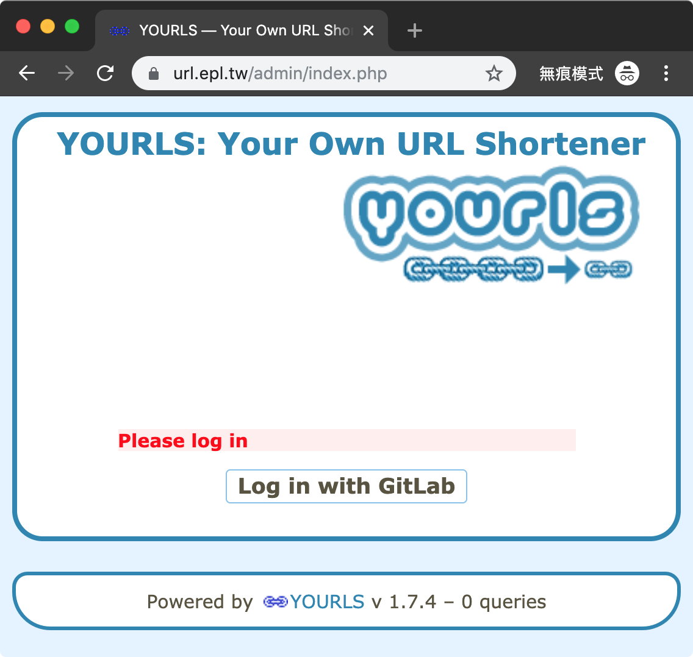
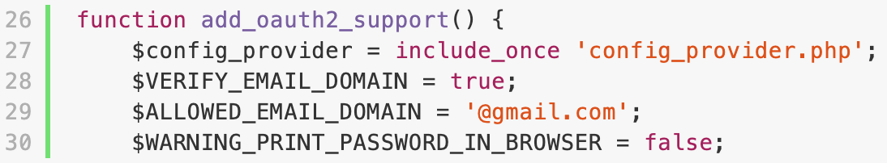
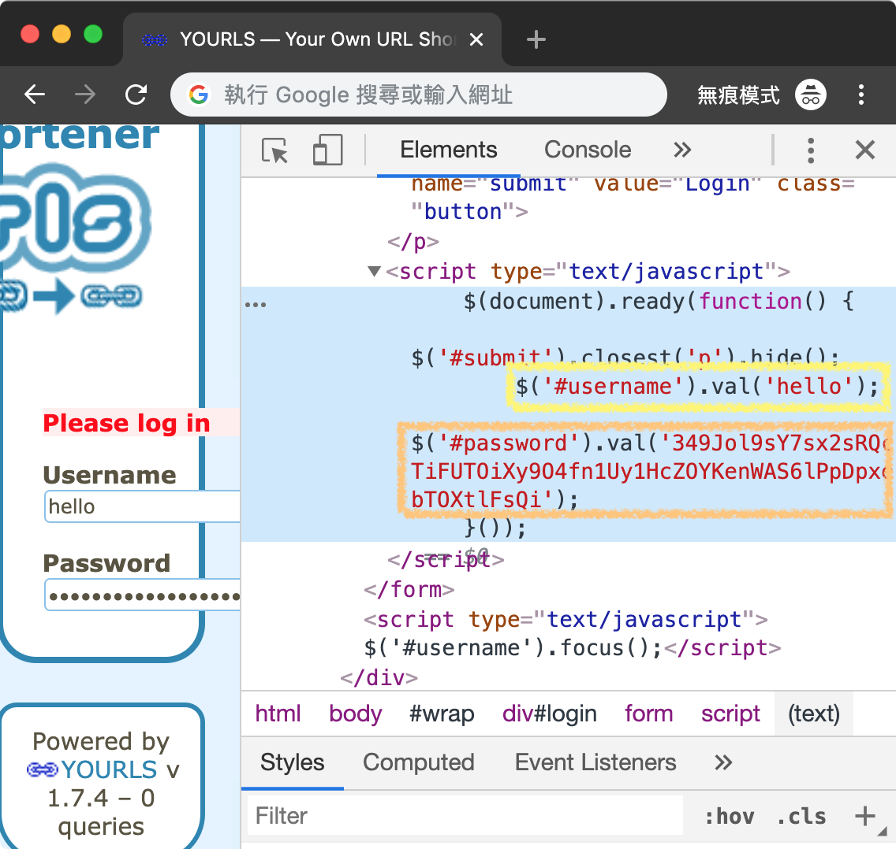

# OAuth Sign In Support | Plugin for [YOURLS](https://github.com/YOURLS/YOURLS)
## About
### - Screenshot


### - ☆ TL;DR
> You may want to refer my [tutorial](https://github.com/LouisSung/YOURLS-Run_with_Docker) to run YOURLS with Docker
1. Meet the [prerequisite](#---prerequisite)
2. Get the generated [grabled password](#---register-user-manually-using-grabled-password) in browser
3. Register user in array [`$yourls_user_passwords`](https://github.com/YOURLS/YOURLS/wiki/Username-Passwords#editing-login--passwords-in-configphp) in config file [`/user/config.php`](https://github.com/YOURLS/YOURLS/blob/1.7.4/user/config-sample.php#L59-L66)

### - Motivation
This plugins is written because my lab is using [GitLab](https://docs.gitlab.com/ee/integration/oauth_provider.html) as a [SSO](https://en.wikipedia.org/wiki/Single_sign-on) provider.  
However, there's no plugin for (generic) OAuth sign in (except one for Google Auth [only](https://github.com/8thwall/google-auth-yourls)) which make me start to write one by myself.  
Of course, such a plugin should support not only GitLab but various SSO providers.  That's why I choose [`thephpleague/oauth2-client`](https://github.com/thephpleague/oauth2-client) as the vendor of this plugin, which is *continually updated* and *easy to use* (important).  
> Actually, this plugin use [`omines/oauth2-gitlab`](https://github.com/omines/oauth2-gitlab) as the vendor, which is based on the former one.

### - Environment
* `YOURLS 1.7.4` (or 1.7.x?)
    + Using official docker images: [`yourls:1.7.4-fpm-alpine`](https://hub.docker.com/_/yourls?tab=tags&page=1&name=1.7.4-fpm-alpine), [`mysql:8.0.18`](https://hub.docker.com/_/mysql?tab=tags&page=1&name=8.0.18), and [`nginx:1.17.5-alpine`](https://hub.docker.com/_/nginx?tab=tags&page=1&name=1.17.5-alpine)
* `omines/oauth2-gitlab 3.1.2` (or 3.x?)
    + Using [composer (in Alpine)](https://pkgs.alpinelinux.org/package/edge/community/x86/composer) to [require](https://github.com/omines/oauth2-gitlab/tree/3.1.2#installation)
    + It's based on [league/oauth2-client](https://github.com/thephpleague/oauth2-client/tree/2.2.1):[^2.2](https://github.com/omines/oauth2-gitlab/blob/3.1.2/composer.json#L22)
* `GitLab 11+` (or 8.17+?)
    + Because GitLab move from API [v3 to v4](https://docs.gitlab.com/ee/api/v3_to_v4.html)
    + Use *league/oauth2-client:^2* as [mentioned](https://github.com/omines/oauth2-gitlab/blame/3.1.2/README.md#L12) if still using ~older *v3 api*~

### - HOW-TO
#### - ☆ Prerequisite
Before start cloning or using this plugin, you have to make sure [`omines/oauth2-gitlab`](https://github.com/omines/oauth2-gitlab/tree/3.1.2#installation) is installed using following command:
```bash
$ composer require omines/oauth2-gitlab:^3.1.2    # run in container
```
> In case you're using official docker image [`1.7.4-fpm-alpine`](https://hub.docker.com/_/yourls?tab=tags&page=1&name=1.7.4-fpm-alpine), you'd like to run `$ apk add composer` in the container first.
#### - Installation
1. Clone files (at least [`plugin.php`](/plugin.php) and [`config_provider.php`](/config_provider.php)) to `YOURLS_ROOT/user/plugins/yourls-oauth_sign_in`
```bash
$ # apk add git                                   # install as needed
$ cd /var/www/html/user/plugins/                  # path in docker
$ git clone https://github.com/LouisSung/yourls-oauth_sign_in
```
2. You should able to **sign in** using `existing user & password` (in *user/config.php*)...
3. Visit `https://YOURLS_SITE/admin/plugins.php` to active plugin named **`Sign in with OAuth`**
4. Sign out and get your `new username & password` in [browser developer tools](https://developer.mozilla.org/en-US/docs/Learn/Common_questions/What_are_browser_developer_tools) (DevTools, Web Inspector, etc.)
5. Register the account(s) by editing array `$yourls_user_passwords` in `/user/config.php` 
6. ฅ• ω •ฅ, you should able to sign in with GitLab by clicking `button` on `https://YOURLS_SITE/admin/index.php`

### - Implementation
#### - Where magic happens
1. Make sure you're using **HTTPS** to prevent potential eavesdroppers!
2. The principle of this plugin is **NOT to bypass** the original log in mechanism, but to **get auto generated password instead**!
    1. First, the *OAuth part* is done by `thephpleague` and `omines` (thanks again), so this plugin don't claim it
    2. Once the response is got, we're able to get `user info` including `id`, `username`, `email`, etc. (the others may not have corresponding wrapper in their implementations)
    3. User should define their own account mapping **`garbled password generating function`** using `id`, `username`, and `email` (which are rarely changed)
    4. Once the account is got (by mapping one of the *user info*) and password is calculated (by *predefined function*), we're ready to sign in
    5. Now, it's time for JavaScript to take place
        1. The password generation is done by PHP on the `server side` (which should be safe)
        2. The generated password is passed to browser via HTTP response (which should also be safe if **using HTTPS**...)
        3. jQuery is used to help on `fill in the account & password form` and `submit the form automatically` for you (where user can modify front-end code and do dangerous things :p)
        4. Once the *account & password* is submit, it use the *original authentication method*, which don't claim by us either
        5. *You can treat this plugin as a **wrapper** that bridges the `OAuth response` and `original Auth process`!*
3. To make things happened, you should [check the **`grabled password`**](#---register-user-manually-using-grabled-password) and register before user can really sign in!
4. Once the *registration procedure* is done, user can easily sign in by *clicking button* and *SSO* :D

#### - ☆ Register user manually (using *grabled password*)
1. When your start runing this plugin, your `https://YOURLS_SITE/admin/index.php` should look like screenshot [above](#--screenshot)
2. Toggle `$WARNING_PRINT_PASSWORD_IN_BROWSER` as **`true`** in `plugin.php` at line [#L30](/plugin.php#L30)
    1. ▼  
        
    2. It then stop and wait after fill in *account & password* rather than *auto submit for user*
    3. Now, password shows in `plaintext` in JavaScript code, where you can copy from and do the *following registration*
    4. ▼  
        
3. **!! REMEMBER** to toggle value back to **`false`**, or just *remove whole `if statement`* (delete line [#L65-L78](/plugin.php#L65-L78) & [#L94](/plugin.php#L94))

#### - My password generating function
* Refer [#L56-L63](/plugin.php#L56-L63), I use `username` as account and `64 digits garbled` as password
  ```php
  $account = $user->getUsername();
  [$PRIME_16DIGITS, $INITIALIZATION_VECTOR] = ['2355457523880889', '7897466719774591'];
  $tmp_pass = str_repeat(substr(strrev($account), -8).substr($account, -8).
                         substr(number_format($user->getID()*floatval($PRIME_16DIGITS), 1, '%', '&'), -16), 4);
  $password = substr(openssl_encrypt($tmp_pass, 'AES-256-CTR', $account, 0, $INITIALIZATION_VECTOR), 7, 64);
  ```
    + For example, when `username == 'yourls'` and `id == 17` get:
      ```php
      $account  = 'yourls'
      $tmp_pass = 'slruoyyourls77&905&975&112%0slruoyyourls77&905&975&112%0slruoyyourls77&905&975&112%0slruoyyourls77&905&975&112%0'
      $password = 'JS/3dllhgxuZMYDdDwPdUyuhP6s5N6XzqTNjwAZH+qa78IuIMOaWb1bAZNp9l0zf'
      ```
* Random seeds: 
    1. Tow of them are major ones: `$PRIME_16DIGITS` and `$INITIALIZATION_VECTOR` [#L60](/plugin.php#L60)
    2. Others like `part of account`, `16 digits int`, `%`, `$`, `substr`, etc. are seeds that can change

### - License
This project is licensed under the following 3 licenses, YOURLS, MIT, and EPL
1. YOURLS: aka `Do whatever the hell you want with it`
2. MIT: aka `MadeInTaiwan Licence` :3
3. EPL: aka `EPL Public License`, where EPL stands for *EmbeddedPlatformLab* (like GNU or YAML, quite cool, huh?)

Feel free to modify it to your own version as needed  
Contact me if having any comments :D
